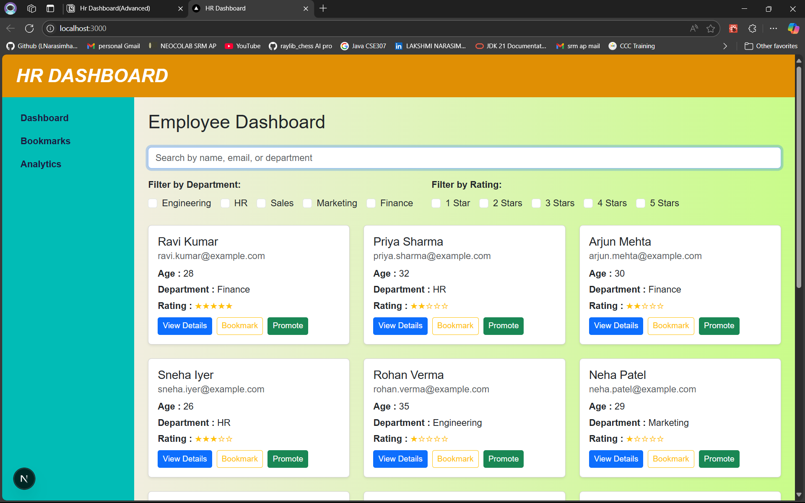
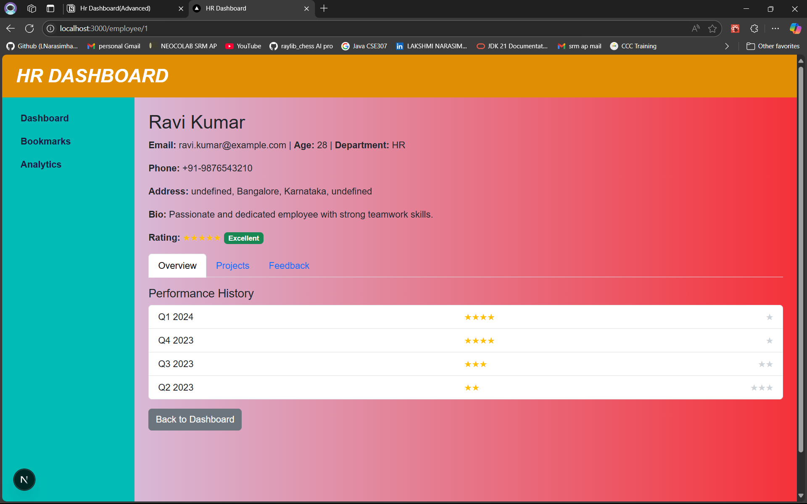
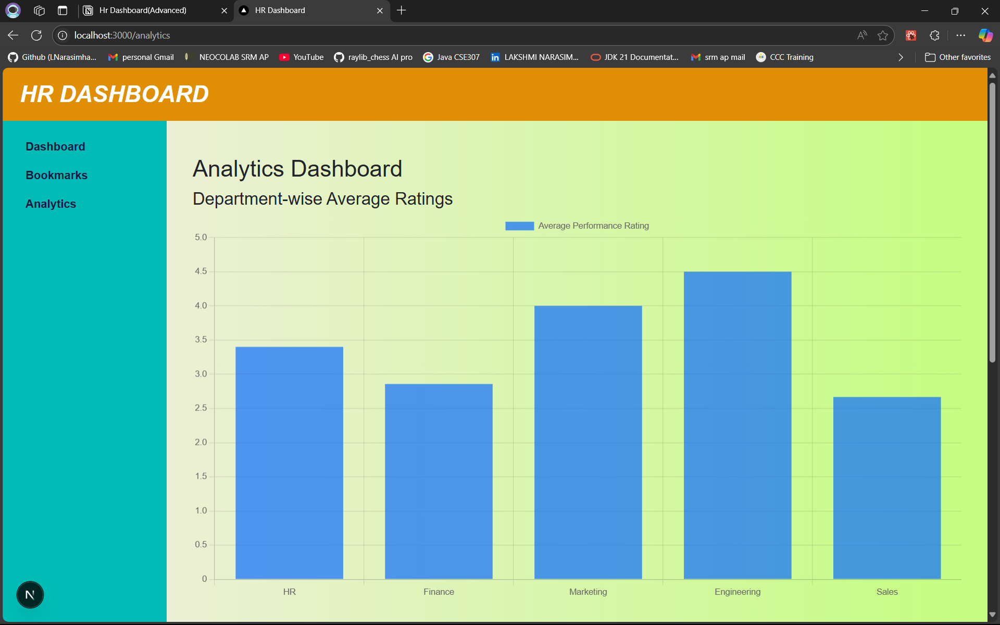

# HR Dashboard

A modern HR Performance Dashboard built with Next.js, React, and Bootstrap.

---

🚀 Setup Instructions

1. Clone the repository:
   ```bash
   git clone <your-repo-url>
   cd <repo name>

2. Install dependencies:
  npm install

3. Run the development server:
  npm run dev

4. Open the app: Visit http://localhost:3000 in your browser.

✨ Features Implemented

Employee Directory:
View a list of employees with key details such as name, email, age, department, and performance rating.

Search & Filter:
Quickly search employees by name and filter by department or rating.

Employee Details:
Click "View Details" to see a detailed profile for each employee, including contact info, address, bio, and performance history.

Performance History:
Visualize each employee's quarterly performance ratings.

Bookmarks:
Bookmark employees for quick access.

Responsive Design:
Fully responsive layout using Bootstrap and custom CSS for a seamless experience on all devices.

Animated Light Gradient Background:
Pleasant, animated background gradient for a modern look.

📸 Screenshots

Add your screenshots in a screenshots/ folder and update the paths below.

Dashboard View:


Employee Details:


Analytics Dashboard:


📁 Folder Structure

src/app/ – Main application code
src/app/page.tsx – Dashboard page
src/app/employee/[id]/page.tsx – Employee details page
src/app/page.module.css – Custom styles


🛠️ Customization

To use your own data, update the API endpoint in src/app/page.tsx and src/app/employee/[id]/page.tsx.
Adjust styles in src/app/page.module.css for branding.
